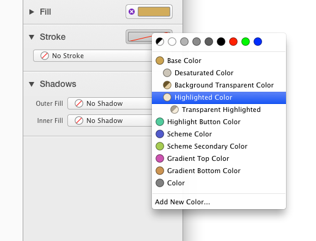

##颜色
在PaintCode里面有3种颜色:

- 系统颜色
- 基础色 (自定义)
- 衍生色 (自定义)

系统颜色为黑色,白色,透明色,红色,绿色,蓝色和几个不同明暗程度的灰色.你不能定义新的系统颜色,他们不在库中显示.但是你可以把它们加入库中来创建你自己的颜色. 这些颜色要么是基础色要么是衍生色.

##基础色
一个基础色就是一个不依赖其他颜色的简单颜色.你可以随时调整它.所有直接或者间接被影响的形状和库项(渐变色,阴影...)都会根据它自动更新.

##衍生色
[视频](https://youtu.be/-WQNE_xyHNg)

衍生色是一个动态依赖其他颜色的颜色. 它是由父颜色通过一些内置的颜色操作产生的:

- 改变透明度
- 改变色调
- 改变明度
- 改变饱和度
- 应用阴影
- 应用高亮
- 拷贝

当父颜色改变了,所有直接和间接(经过其他颜色)的衍生色都会自动更新.显示在库中的颜色按层级排列 - 衍生色是他们基础色的孩子.

## 使用颜色
有三种方法可以给形状设置颜色.

首先, 你可以点击拖拽连接点到画图的形状上,然后选择你想要这个颜色应用到哪个属性. 链接点显示在库里面颜色的旁边. 如果颜色还没有在文档中使用,则连接点是一个空心圆.

另一种方法是在内省器里面使用Stroke或者fill槽.当槽是空的时候,意味着这个属性还没有被设置.点击槽出现菜单供你选择你想使用的颜色.菜单的选项为库中的颜色.在菜单的顶部为系统色.

顺便说一句,想要停止形状使用这个颜色,在槽的左边点击紫色的叉即可.

第三种方法就是从颜色弹出按钮菜单中选择:

这三种方法都是相等的 - 你应该选择最方便的.

##添加新颜色
有几种方法可以添加新颜色:

- 在库中颜色部分的顶部,点击`+`按钮.
- 在弹出菜单中选择`Add new color...`选项. 这种方式也会设置新创建的颜色为当前属性的值.
- `COMMAND` + 点击已经设置颜色的内省器里面的槽. 这种方式的话, 会在库中出现一份此颜色的拷贝.

添加新颜色之后, 会出现一个颜色编辑弹框. (注意你也可以通过从其他文档中拷贝粘贴具有颜色的形状来添加颜色),也可以双击弹出.

##编辑颜色
你可以通过双击库中的颜色来编辑它,你也可以点击内省器中的槽来显示一个编辑颜色弹框.

输入框中包含颜色的名字.PaintCode会为你自动生成所有的名字, 不过你可以重新命名让它更有描述性.

有两种颜色: `基础色`和`衍生色`.基础色是`Base Color`设置为`None`的颜色.对于基础色,你只需要从颜色选择器中选择一个的颜色.你可以用不同格式设置具体的值,调整突出的小球或者使用弹框右下角的放大镜取屏幕的某一个颜色.

通过选择基础色,你将创建一个衍生色.你需要指定期望的操作和数量.举例,你可以设置和苦衷其他颜色相同的颜色,但是只有50%的透明度,这是一个非常有用的特征.

当衍生色的父颜色(可能是基础色,也可能是衍生色)改变的时候,衍生色会自动更新.

##删除颜色
当你想删除已经被绘图使用的颜色时, 会显示删除表单.这个表单通知你关于所有将被影响到的形状和其他库项.

当你删除了一个颜色后,使用它的所有形状,渐变色,阴影和变量都会替换成默认色(红色).所有直接衍生自被删除颜色的颜色转成基础色,但是外表上保持不变.

##让颜色在生成的代码和符号中表现为参数
想学习更多关于如何配置颜色和其他库项成参数,阅读 [库项行为](core_concepts.md).
