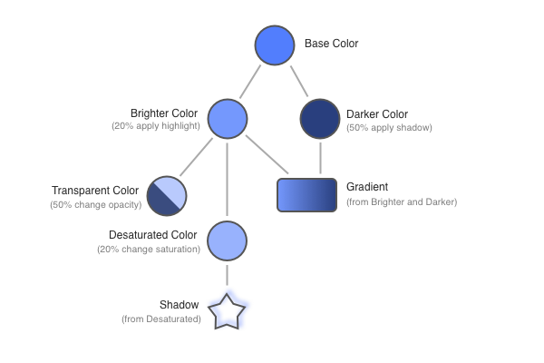
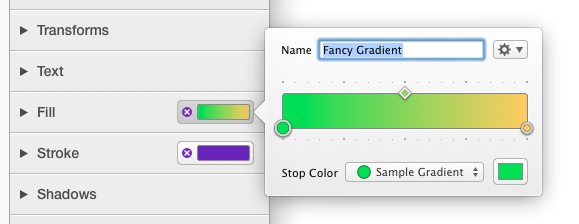
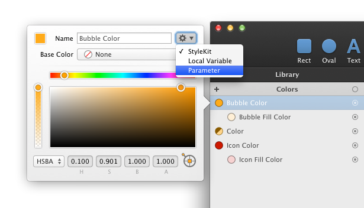

##核心概念
库是你创建和管理颜色,渐变色,阴影,图片和变量的地方.这些库项都是为你的UI设计量身定制的.

举个例子,你可以在多个图像的形状上使用同样的颜色,之后,如果你改变了颜色，所有的你绘制图片中的形状都被自动更新。渐变色,阴影,图片和变量也亦然.

这个特征非常的有用,因为你可以很容易地在一个地方调整你设计UI的颜色方案.

而且, 一些库项可以形成关系.举个例子,通过内置的操作可以从一个已存在的颜色中,产生新颜色.渐变色和引用也可以产生于库项中的颜色.表达式变量可以引用其他库项.

通过运用这种特种的优势, 你可以定义依赖于一个(或者多个)基础色的颜色,渐变色和阴影的整个家谱.当你调整这个基础色的时候，所有直接或者间接被依赖的库项和形状都会自动更新:

举个例子,当你正在设计一组颜色丰富的UI控制视图的时候, 你可以有一个单独的基础色产生所有需要的颜色,渐变色和阴影. 之后,通过调整这个基础色,你可以轻而易举地改变你整个文档的配色方案.

##命名
每一个库项都有一个名字, PaintCode为你生成这些名字,但是你可以(可能应该)提供你自己的,更具有描述性的名字.这些名字被代码生成器使用. 你可以在名字里面使用空格 - PaintCode在生成的代码中自动把`Button Base Color` 转成 `buttonBaseColor`. 它也不允许你使用已经被保留的名字. 所有你不需要担心潜在的命名冲突.
库项可以被重新命名在各自的调整弹框里面, 你可以通过双击库项访问调整弹框.

##使用库
库被分成了5个部分:颜色,渐变色,阴影,图片和变量. 要想添加一个新的库项(比如颜色),只需要在对应的部分的顶部点击`+`按钮.

要想移除一个库项, 点击这项,按`DELETE`或者`BACKSPACE`键. 想要调整已存在的库项,双击这项.你也可以在内省器里面点击库项槽,内省器会显示编辑弹框.

##拷贝与粘贴行为
当你在文档之间拷贝和粘贴一些形状的时候,所有需要的颜色,渐变色,阴影和图片也会自动的拷贝到目的文档.如果目标文档已经存在了需要的库项,则会重用库项.

##配置库项用以表现参数
每一个库项都有一个特殊的弹出按钮在名字输入框的右边(弹出框按钮有一个齿轮图标)

在这,你可以配置库项的行为,这对[代码生成器](../stylekits_and_code_generation/stylekits.md)和[符号](../symbols/using_symbols.md)来说非常重要.

通过把行为弹出框的值改变为`Parameter`, 你可以保证每一个使用到这个库项的canvas生成的绘制方法都有一个参数. 举个例子,这允许你创建一个使用你运行时指定颜色来绘制图片的绘制方法.

如果你选择`StyleKit`选项, 库项将自动被加入到StyleKit里面.
