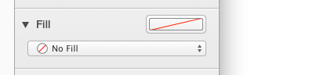
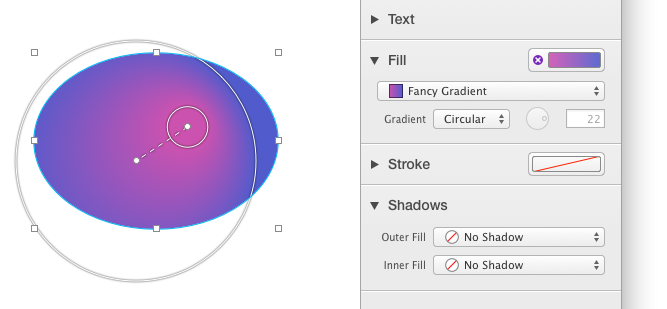

##渐变色

渐变色可以用来填充举行,圆角矩形,椭圆,贝塞尔曲线,星形和多边形.PaintCode支持多步渐变色.你也可以选择(由角度定义的或者由两个点定义的)线性渐变色或者圆形渐变色.渐变色依赖于他们使用的颜色,当这些颜色调整了,渐变色也会根据颜色自动更新.

##使用渐变色
想要使用渐变色, 只需要点击拖动渐变色连接点到画布上面的形状:

你也可以简单的在内省器里面点击空的stroke或者fill并从菜单中选择渐变色:

你也可以从弹出按钮菜单中选择渐变色:

这个菜单的项为库中的颜色和渐变色.

##添加新渐变色
有两种方法添加新的渐变色:

- 在库中渐变色列表的顶部点击`+`按钮.
- 在填充弹出菜单中选择`Add new graident...`. 这个操作也会设置新创建的渐变色为当前属性的值.(注意你也可以通过从其他文档拷贝和粘贴来添加渐变色)

##编辑渐变色
你可以通过双击库中的渐变色来编辑它.

你也可以点击内省器中的渐变色槽来显示一个编辑颜色弹框.

这个输入框包含了渐变色的名字. PaintCode为你生成所有的名字, 但是你可以改成更具有描述性的名字.

这个弹框包含了一个特殊的渐变色控制器. 你可以使用它来指定渐变色中每个颜色的位置.

##改变渐变色的色值
要在渐变色中改变颜色,点击在渐变色控制器下面的颜色球.然后从渐变色控制器下面的颜色弹出按钮中选择你想要的颜色.

##在渐变色弹框中方便地调整色值
有时,你需要调整渐变色中颜色的明暗.你可以关掉渐变色弹框,打开颜色弹框,调整颜色,不过这样太不方便了. 
其实, 你可以通过渐变色弹框中右下角的槽来调整.

##从渐变色弹框中直接添加新颜色
如果你想调整渐变色弹框中颜色槽里的颜色不是基础色(也就是说可能是系统色或者衍生色),这样的话,就会自动创建一个新的基础色代理之前的颜色.

##调整增渐变色的位置
想要调整渐变色中颜色的位置,只需要简单的拖动颜色球到你想要的位置.要想把颜色放在预定义的位置上,只需要按住`Shift`键.预定义的位置就会出现刻度线.

你也可以时候用键盘上的`Left`和`Right`方向键来微调颜色球的位置.
Alternatively, you can fine tune the position of the selected knob using the LEFT and RIGHT arrows on your keyboard.

##调整颜色之间的线性关系

通过拖动渐变色控制器顶部的小球, 可以改变渐变色中两个相邻颜色之间的距离.

##给渐变色添加更多的颜色
双击渐变色控制器中你想要的位置,就可以添加额外的颜色到渐变色上.默认被添加上的颜色是黑色(你可以稍后在弹出按钮中选择其他颜色).

##从渐变色中移除颜色
要想移除颜色,只需要在渐变色控制器中选择对应颜色的小球,然后按`Delete`键即可.注意:这只是从渐变色中移除颜色,并不是从库中.

##绘制线性渐变色
在内省器中填充弹出按钮菜单中选择渐变色之后, 只可以选择`Angle`渐变色选项.

要想调整渐变色的角度, 你可以直接在输入框中输入角度,也可以使用圆形调节杆控制器.默认地,在拖动圆形调节杆的时候,只会跟45度的倍数对齐.你可以拖动的时候按住`Option`键,这样就可以顺滑的拖动.

如果你想要手动指定渐变色的开始点和结束点,你可以选择`2 Points`渐变色选项. 一个两点渐变色变色界面自动会出现在画布上. 当你选择一个两点渐变色填充的形状时或者内省器的Fill属性展开时,这个界面就会出现.

##绘制圆形渐变色
想要绘制圆形的渐变色, 你需要选择`Circular`渐变色选项.

一个圆形渐变色编辑界面自动出现在画布上.这个界面只有当你选择圆形渐变色填充的形状时才会出现.它包含两个圆,每一个代表一个圆形家变色的端点.

你可以拖动这些圆形的中心到新的位置.另外,你也可以拖动圆的边来调整圆的尺寸.

默认这些圆都是跟编辑形状的边缘对齐的.想要避免这样,只需按住`Control`键.
