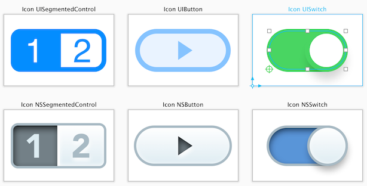

#概述

PaintCode是一个矢量绘图软件,可以将你的绘图实时转成Objective-C，Swift,C#代码,软件窗口被分成几个部分,以便快速容易地访问你将会需要的东西.

##工具栏
在窗口顶部的工具栏包含了你最经常使用的绘图工具.

##标签页与StyleKit
在工具栏下面的中间位置,你会发现标签页栏. 你可以在PaintCode文档里面使用标签页来管理绘图.每一个标签页可能包含多个画布.

第一个标签页(名为:'StyleKit') 比较特殊.它为你提供了访问StyleKit分类的能力. StyleKit分类是一个集合,包含了绘图，颜色，渐变色和其他设计资源，你可以把它轻松导出成一个单独的Objective-C,Swift,C#类.StyleKits可以让你轻松地将生成的代码集成到你的项目中去.

##库
库(窗口的左边)是一个集合，包含了你所有的颜色，渐变色，阴影，图片和变量。所有这些库项可以容易地重用在整个文档里面。库项在PaintCode文档里面是独立的，当你改变了一个库项的时候，所有的使用到这个库项的绘图都会被立即更新.

##画布
软件窗口中间的位置包含了当前被选中标签页的内容.一般的,你将在这个区域看到一个或者多个画布.

##代码视图与中间工具栏
中间的工具栏可以让你改变代码生成器设置(比如目标编程语言和操作系统).他也可以允许你改变画布显示设置比如放大和像素密度(视网膜屏(Retina),非视网膜屏(non-Retina)或者无限模式(Infinite)).

在工具栏下面的代码视图包含了生成的代码. 这为你的绘图画布留下了更多的空间,也改善了性能当处理复杂的文档时候.

##形状与群组浏览器
形状与群组浏览器位于窗口的右边,工具栏的下面. 这是当前被选择画布的所有形状的列表。 根部为画布本身.当你选择画布的时候，下面的内省器的内容会 变成画布的设置.

##内省器
内省器窗口的右边.它允许你改变你当前选择对象的属性，一般就是你画布里面的形状.

